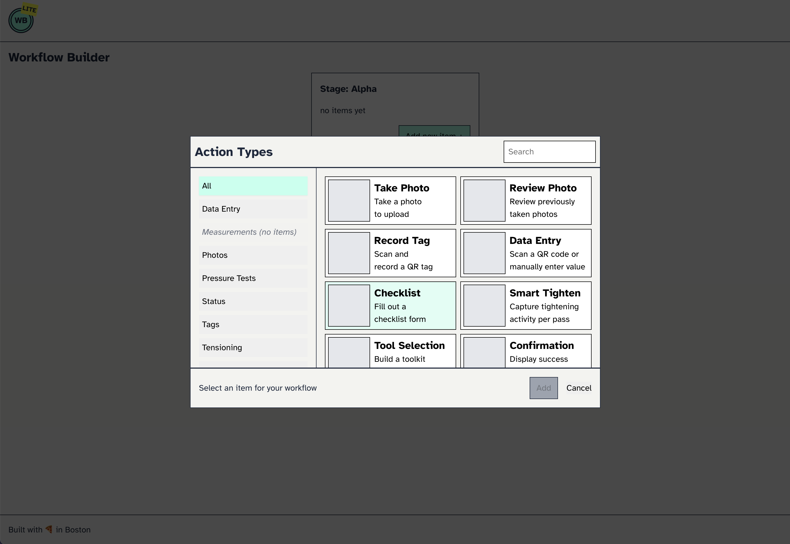

# Water Buffalo Lite

## Description
Water Buffalo Lite is a small sample React app that allows to select items from a catalog and add them to a "stage".

## UI Preview



## Installation
To install the project, clone the repository and install the dependencies:

```bash
git clone https://github.com/troyciesco/water-buffalo-lite.git
cd water-buffalo-lite
npm install
```

## Usage
To start the application, run:

```bash
npm run dev
```